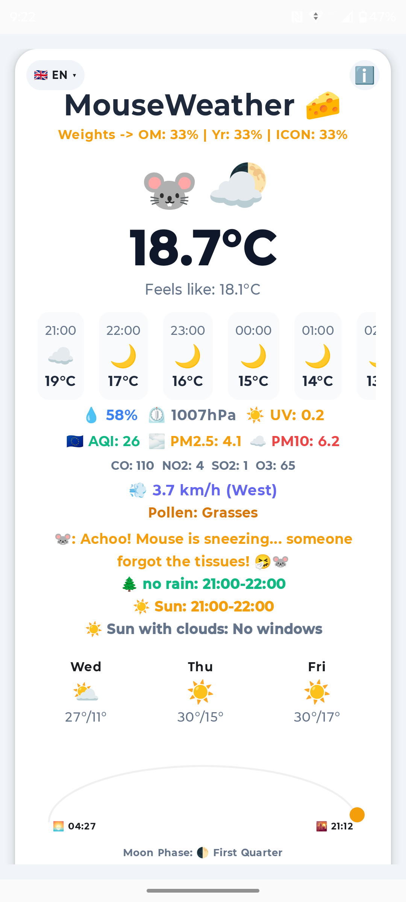
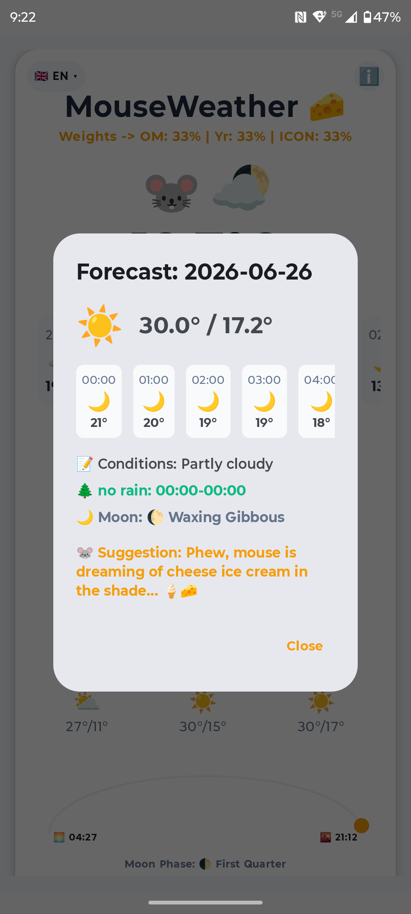
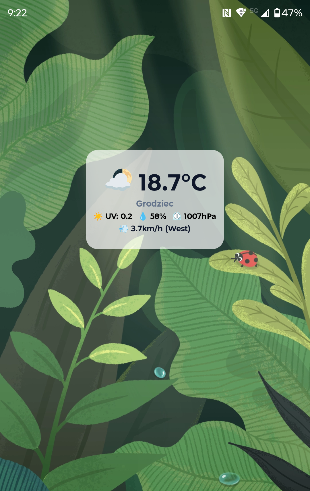
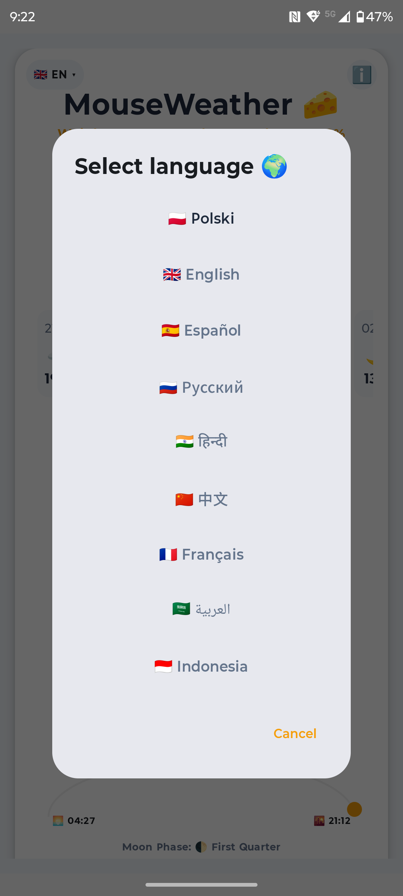
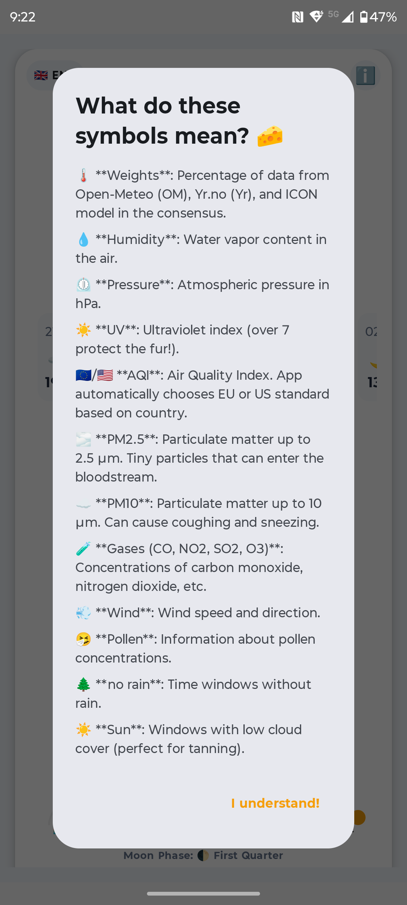

🐭 MouseWeather

MouseWeather is a privacy-focused Android weather app that combines multiple data sources to provide a temperature consensus, all presented in a charming mouse-themed interface.

MouseWeather supports 9 languages, making it accessible to users worldwide:

🇵🇱 Polish, 🇬🇧 English, 🇪🇸 Spanish, 🇷🇺 Russian, 🇮🇳 Hindi, 🇨🇳 Chinese, 🇫🇷 French, 🇸🇦 Arabic, 🇮🇩 Indonesian.

✨ Features

Temperature Consensus: Combines data from Open-Meteo and MET Norway.

Air Quality: Real-time AQI and pollen information.

Weather Alerts: Notifications for storms, high UV, and sun windows.

Moon Phases: Beautifully calculated moon phases for every night.

Privacy First: No trackers, no ads, no non-free services.

🧀 PL (Polski)
MouseWeather to aplikacja pogodowa dbająca o prywatność, która zapewnia konsensus temperatury z wielu źródeł, prezentując dane w interfejsie z motywem myszy.

🛠 Built with
•
Kotlin & Jetpack Compose
•
Ktor for networking
•
WorkManager for background updates

📜 License
Licensed under the Apache License 2.0. See LICENSE for details.

    

   

